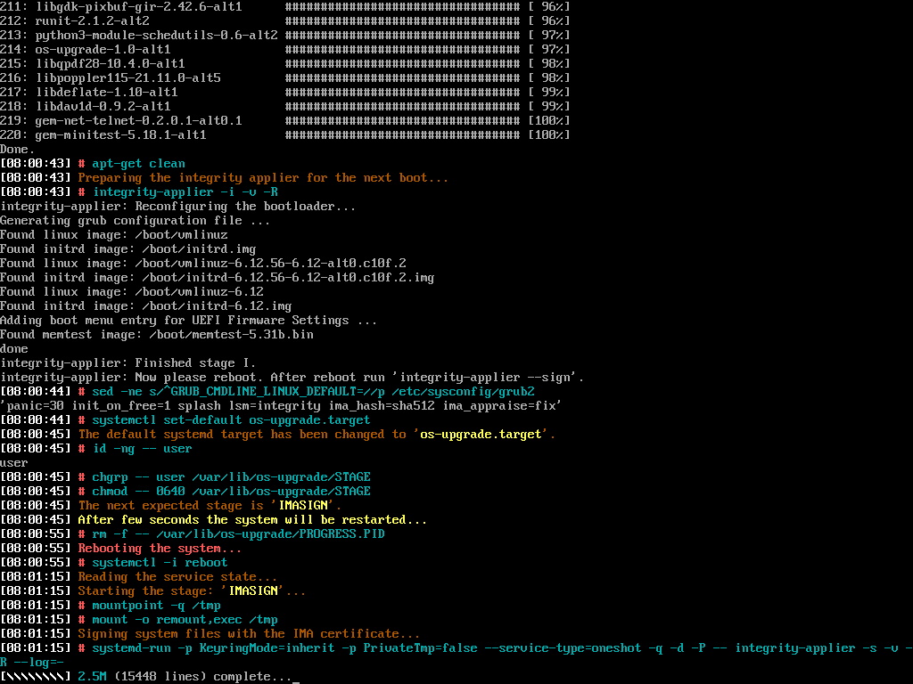

# Обновление Альт СП релиз 10 (c10f1) до 10.2.2 (c10f2)

Данное обновление может быть выполнено только для ФСТЭК редакции Альт СП
релиз 10 в исполнении «Сервер» или «Рабочая станция», что соответствует
записям «ALT SP Server 11100-01» и «ALT SP Workstation 11100-01» в файле
`/etc/os-release`. Для других дистрибутивов обновление не предназначено.

## Стадии обновления

* `CHECKS`: Проверяет все необходимые условия и возможность обновления.
  В случае Альт СП «Сервер», если не установлена переменная окружения
  `SUSPEND_BUTTONS`, то также маскируются режимы suspend и hibernate,
  см. баг: [ALT #47595](https://bugzilla.altlinux.org/47595).
* `START`: Определяет начальное состояние ряда сервисов, копирует скрипты
  os-upgrade в `/usr/local/libexec`, исправляет некоторые известные проблемы
  уже развёрнутых систем ОС Альт, готовит регулярный журнал, каталог состояния
  демона (`/var/lib/os-upgrade`) и запускает сервис обновления.
* `PREPARE`: Готовит конфигурацию apt/rpm и скачивает пакеты в локальный кэш.
* `IMA-OFF`: Отключает защиту IMA/EVM, если она была включена до обновления.
* `UPGRADE`: Обновляет систему из c10f1, обновляет систему и ядро из c10f2.
* `FINALIZE`: Удаляет все старые ядра и не нужные пакеты, включая os-upgrade.
* `IMASIGN`: Подписывает системные файлы сертификатом и включает защиту IMA.
* `DEINIT`: Восстанавливает состояние ряда служб, завершает работу сервиса
  os-upgrade и запускает скрипт окончательной очистки данного пакета.
* `CLEANUP`: Удаляет все оставшиеся файлы пакета, кроме журнала обновления.

Прохождение стадий, число перезагрузок, выполнение в тех или иных таргетах
systemd, зависит от исходного состояния системы и параметров запуска утилиты.
В простом случае по умолчанию предполагается следующая цепочка выполнения:

`CHECKS`->`START`->`PREPARE`->`UPGRADE`->`FINALIZE`->`DEINIT`->`CLEANUP`.

## Внешний вид

Удачного обновления! :-)

